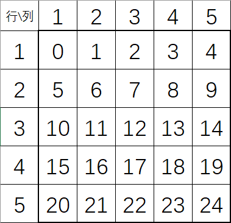

# 对于例子中的线性方程组的一些建模

我们将这个$5\times 5$的表格中的每个点改写为1-25的坐标，具体方式为:

$(i,j)\rightarrow (i-1)*5+(j-1)$

那么表格中的每个格子都抽象为了一个数，如图所示：

在每个状态中，由于动作选择是等概率的，于是$\pi(up|s)=\pi(down|s)=\pi(left|s)=\pi(right|s)=\frac{1}{4}$.

并且选择动作之后的收益和状态都是确定的，那么四参数函数$p(s',r|s,a)=1,\forall s,s'\in \mathcal{S}, r\in \mathcal{R}, a\in \mathcal{A}$.

#### 对于角落点$s=\{0,4,20,24\}$
我们对于$s=0$举例子，可以列出方程为:

$v_{\pi}(0)=\frac{1}{4}\times ((-1+\gamma v_\pi(0) )+(0+\gamma v_\pi(5))+(-1+\gamma v_\pi(0))+(0+\gamma v_\pi(1)))$
其中后面的四个括号分别对应上、下、左、右四个状态。

化简可得：
$\frac{2-\gamma}{2}v_{\pi}(0)-\frac{\gamma}{4}(v_\pi(1)+v_\pi(5))=-\frac{1}{2}$
同理可得剩下的三个状态的方程。

#### 对于边界的非奖励点$s=\{2,5,9,10,14,15,19,21,22,23 \}$
我们对$s=2$举例子，可以列出方程为：

$v_{\pi}(2)=\frac{1}{4}\times ((-1+\gamma v_\pi(2) )+(0+\gamma v_\pi(7))+(0+\gamma v_\pi(1))+(0+\gamma v_\pi(3)))$
其中后面的四个括号分别对应上、下、左、右四个状态。

化简可得：
$\frac{4-\gamma}{4}v_{\pi}(2)-\frac{\gamma}{4}(v_\pi(7)+v_\pi(1)+v_\pi(3))=-\frac{1}{4}$
同理可得其余状态的方程。

#### 对于奖励点$s=\{1,3\}$
我们对$s=1$举例子，因为其一定转移到$s'=21$，所以可以列出方程为：
$v_\pi(1)=10+\gamma v_\pi(21) $

化简可得：
$v_\pi(1)=10+\gamma v_\pi(21) $

同理可得$s=3$的方程

#### 对于剩下的点$s=\{6,7,8,11,12,13,16,17,18\}$

我们对$s=6$举例子，可以列出方程为：
$v_\pi(6)=\frac{1}{4}\times((0+\gamma v_\pi(1))+(0+\gamma v_\pi(5))+(0+\gamma v_\pi(7))+(0+\gamma v_\pi(11)))$

化简可得
$v_\pi(7)-\frac{\gamma}{4}(v_\pi(1)+v_\pi(5)+v_\pi(7)+v_\pi(11))=0$

同理可得其余状态的方程。

这样就得到了一个未知数为25，方程数为25的线性方程组，用C++求解即可。